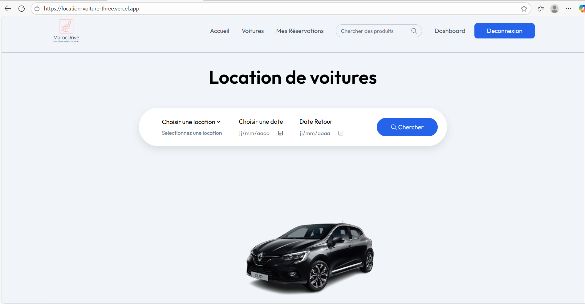
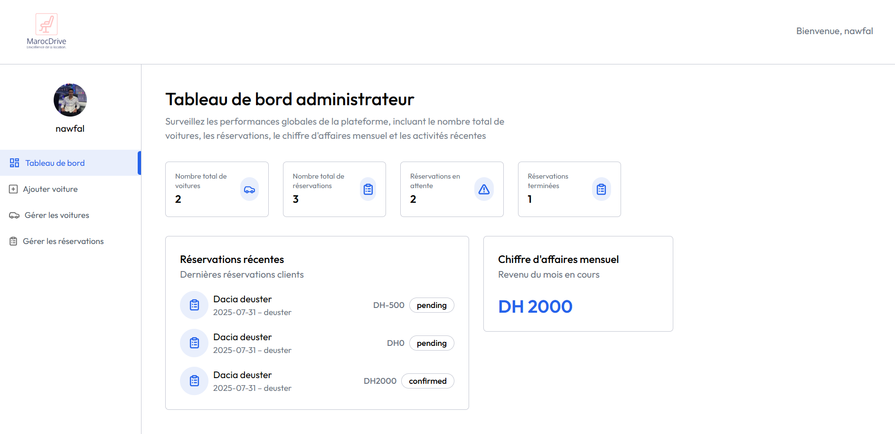
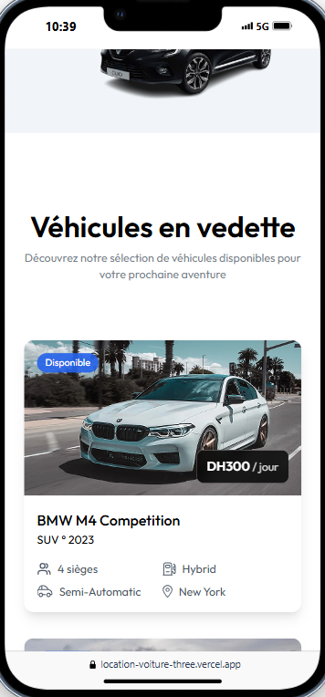

# 🚗 MarocDrive - Application de Location de Voitures

<div align="center">
  
</div>

Une application web moderne de location de voitures développée avec React et Node.js, spécialement conçue pour le marché marocain.

## 📱 Captures d'écran

### Page d'accueil

*Interface épurée avec barre de recherche intuitive et filtres avancés*

### Dashboard Administrateur

*Vue d'ensemble des statistiques et gestion des réservations*

### Système de Réservation

*Interface de réservation avec sélection de dates et calcul automatique*

### Gestion des Véhicules

*Interface d'ajout et modification des véhicules*

### Version Mobile Responsive

*Interface adaptée pour tous les appareils mobiles*

## 🌟 Fonctionnalités Principales

### 🔑 Système d'Authentification
- Connexion/Inscription sécurisée
- Gestion des rôles (utilisateur/propriétaire)
- Authentification JWT
- Protection des routes

### 🚙 Gestion des Véhicules
- Ajout de nouvelles voitures avec détails complets
- Upload d'images optimisé via ImageKit
- Modification en temps réel des informations
- Gestion intelligente de la disponibilité

### 📅 Système de Réservation
- Sélection intuitive des dates
- Vérification automatique de disponibilité
- Calcul dynamique des prix
- Suivi du statut des réservations

### 📊 Dashboard Administrateur
- Statistiques en temps réel
- Gestion centralisée des réservations
- Suivi du chiffre d'affaires
- Interface d'administration complète

## 🛠 Technologies Utilisées

### Frontend
- **React** + **Vite** - Interface utilisateur moderne
- **TailwindCSS** - Styling responsive
- **Context API** - Gestion d'état globale
- **Axios** - Communication HTTP
- **React Router** - Navigation
- **React Hot Toast** - Notifications

### Backend
- **Node.js** + **Express** - Serveur API REST
- **MongoDB** + **Mongoose** - Base de données NoSQL
- **JWT** - Authentification sécurisée
- **Multer** - Gestion des fichiers
- **ImageKit** - Optimisation d'images

## 📁 Structure du Projet

```
location_voiture/
├── client/                     # Frontend React
│   ├── public/
│   │   └── index.html
│   ├── src/
│   │   ├── assets/            # Images, icônes
│   │   ├── components/        # Composants réutilisables
│   │   │   ├── Layout/        # Components de mise en page
│   │   │   ├── Forms/         # Formulaires
│   │   │   └── UI/            # Éléments d'interface
│   │   ├── context/           # Context API
│   │   ├── pages/             # Pages principales
│   │   │   ├── Home/
│   │   │   ├── Auth/
│   │   │   ├── Dashboard/
│   │   │   └── Booking/
│   │   ├── utils/             # Utilitaires
│   │   └── App.jsx
│   ├── package.json
│   └── vite.config.js
├── server/                     # Backend Node.js
│   ├── configs/               # Configurations
│   │   ├── database.js
│   │   └── imagekit.js
│   ├── controllers/           # Logique métier
│   │   ├── authController.js
│   │   ├── carController.js
│   │   └── bookingController.js
│   ├── middleware/            # Middlewares
│   │   ├── auth.js
│   │   └── upload.js
│   ├── models/               # Modèles MongoDB
│   │   ├── User.js
│   │   ├── Car.js
│   │   └── Booking.js
│   ├── routes/               # Routes API
│   │   ├── auth.js
│   │   ├── cars.js
│   │   └── bookings.js
│   ├── package.json
│   └── server.js
├── screenshots/              # Captures d'écran
└── README.md
```

## 🚀 Installation et Configuration

### Prérequis
- Node.js (v16 ou supérieur)
- MongoDB
- Compte ImageKit (pour l'upload d'images)

### 1. Cloner le projet
```bash
git clone https://github.com/votre-username/marocdrive.git
cd marocdrive
```

### 2. Configuration Backend
```bash
cd server
npm install
```

Créer un fichier `.env` dans le dossier `server/` :
```env
PORT=3000
MONGODB_URI=mongodb://localhost:27017/marocdrive
JWT_SECRET=votre_jwt_secret_super_securise
IMAGEKIT_PUBLIC_KEY=votre_imagekit_public_key
IMAGEKIT_PRIVATE_KEY=votre_imagekit_private_key
IMAGEKIT_URL_ENDPOINT=https://ik.imagekit.io/votre_id
```

### 3. Configuration Frontend
```bash
cd ../client
npm install
```

Créer un fichier `.env` dans le dossier `client/` :
```env
VITE_CURRENCY=DH
VITE_BASE_URL=http://localhost:3000
```

### 4. Lancement de l'application
```bash
# Terminal 1 - Backend
cd server
npm run dev

# Terminal 2 - Frontend
cd client
npm run dev
```

L'application sera disponible sur `http://localhost:5173`

## 📊 Statistiques du Projet

- **2** voitures disponibles
- **2** réservations en attente
- **1** réservation terminée
- **2000 DH** de chiffre d'affaires mensuel

## 🎯 Roadmap

- [ ] Système de paiement en ligne (Stripe/PayPal)
- [ ] Notifications par email automatiques
- [ ] Application mobile React Native
- [ ] Support multilingue (Français/Arabe)
- [ ] Système d'avis et notation
- [ ] Géolocalisation des véhicules
- [ ] Chat en temps réel
- [ ] Export des rapports PDF

## 🤝 Contribution

Les contributions sont les bienvenues ! Pour contribuer :

1. Fork le projet
2. Créer une branche feature (`git checkout -b feature/AmazingFeature`)
3. Commit vos changements (`git commit -m 'Add some AmazingFeature'`)
4. Push vers la branche (`git push origin feature/AmazingFeature`)
5. Ouvrir une Pull Request


## 📫 Contact

- **Email**: contact@marocdrive.com
- **Site Web**: [www.marocdrive.com](https://www.marocdrive.com)
- **GitHub**: [@marocdrive](https://github.com/marocdrive)

## ⭐ Support

Si vous trouvez ce projet utile, n'hésitez pas à lui donner une étoile ! ⭐

---

*Développé avec ❤️ au Maroc*
